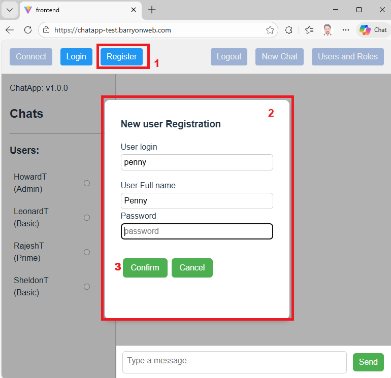

<a href="../Readme.md">Home</a>

# ChatApp - User Guide  

## Table of Contents

- [Open frontend and connect to server](#open-frontend-and-connect-to-server)
- [Register new user](#register-new-user)
- [Login](#login)
- [Logout](#logout)
- [Create new chat](#create-new-chat)
- [Send message](#send-message)
- [Select chat](#select-chat)
- [User role management](#user-role-management)

## Open frontend and connect to server

- Open in Browser: https://chatapp-test.barryonweb.com/
- Initially app is connected to server, if not hit F5(refresh) or click top left Connect button 

## Register new user 

- Click on button Register, enter user information and click Confirm:
  

- Expected: new user is shown in the Users list on the left. Default assigned roles for the new user are
  - Basic (claim: sendMessage )
  - Prime (claims: sendMessage, createChat)
- Role that is not assigned by default and enables user role management is
  - Admin (claims: sendMessage, createChat, manageUsers)

Testing user role managament is described in [the separate Chapter](#user-role-management)

## Login  

### Manual login

- Click on button Login, select user, enter password and click Confirm:
- Expected: you are logged in as selected user is

### Refresh test

- Once logged in, browser refresh will keep you logged in. Hit f5 (refresh)
- Expected: still logged in as s the same user 

## Logout  

### Manual logout

- Click on button Logout  
- Expected: you are logged out 

### Refresh test

- Once logged out, browser refresh will keep you logged out. Hit f5 (refresh)
- Expected: still logged out.  

## Create new chat 

## Send message

## Select chat

## User role management

